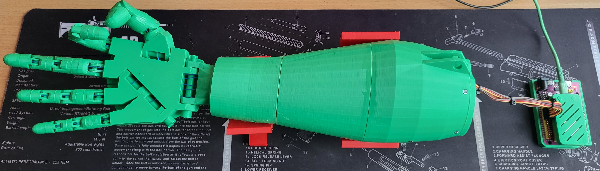

# Robo Hand

## Overview
**Robo Hand** is a project for controlling a robotic hand based on **ESP32** and servo motors.  
The goal is to build a modular system for precise finger and wrist movement control, using real-time protocols and sensor platforms.  
ESP32 provides processing power, and flexibility for integration with external devices.

---

## Features
- Servo motor control via ESP32
- Support for real-time protocols
- Example applications for testing hand movements

---

## Repository Structure
- `HandServoCtrl/` — main controller logic for servo control  
- `hand_servo/` — low-level drivers and usage examples  
- `img/` — diagrams and illustrations  
- `LICENSE` — GPL-3.0 license  

---

## Installation
1. Clone the repository:
   git clone https://github.com/maksym-sydorenko/robo_hand.git

---

## Build FW
2. Open the project with ESP-IDF CMD
idf.py set-target esp32
idf.py build
idf.py flash

---

## Build SW
3. Open HandServoCtrl.sln in MSVC 2019 build and run.

